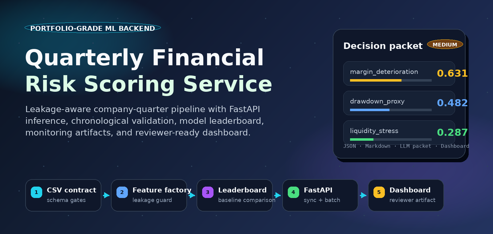
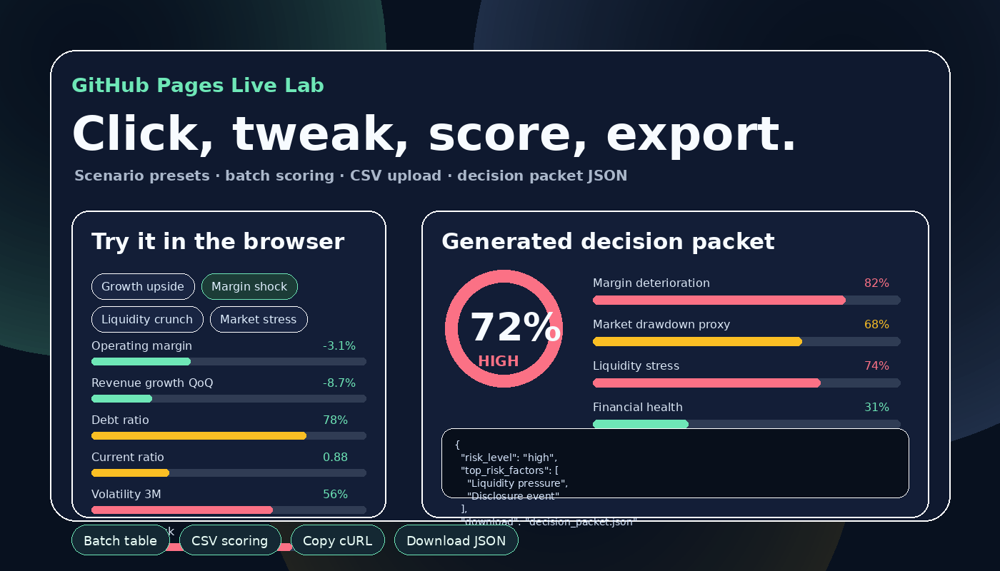
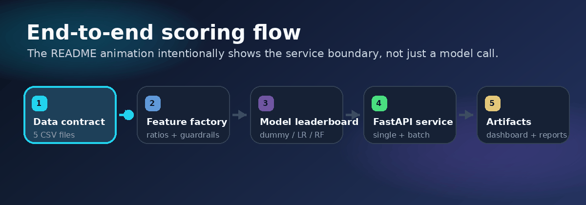
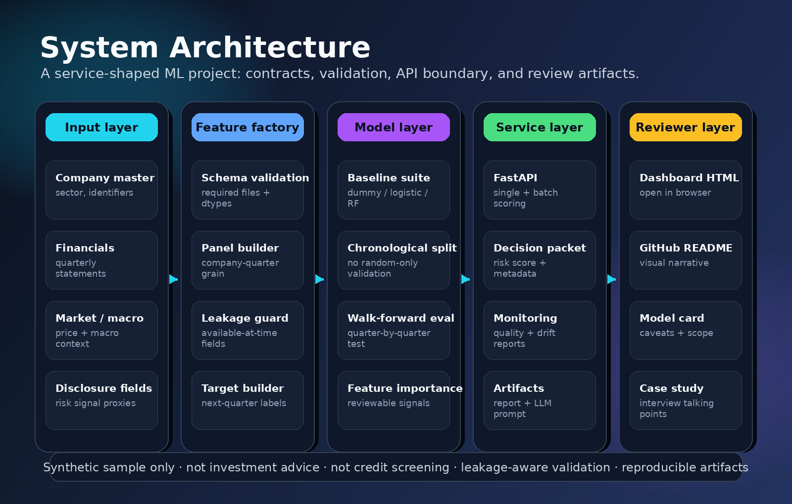
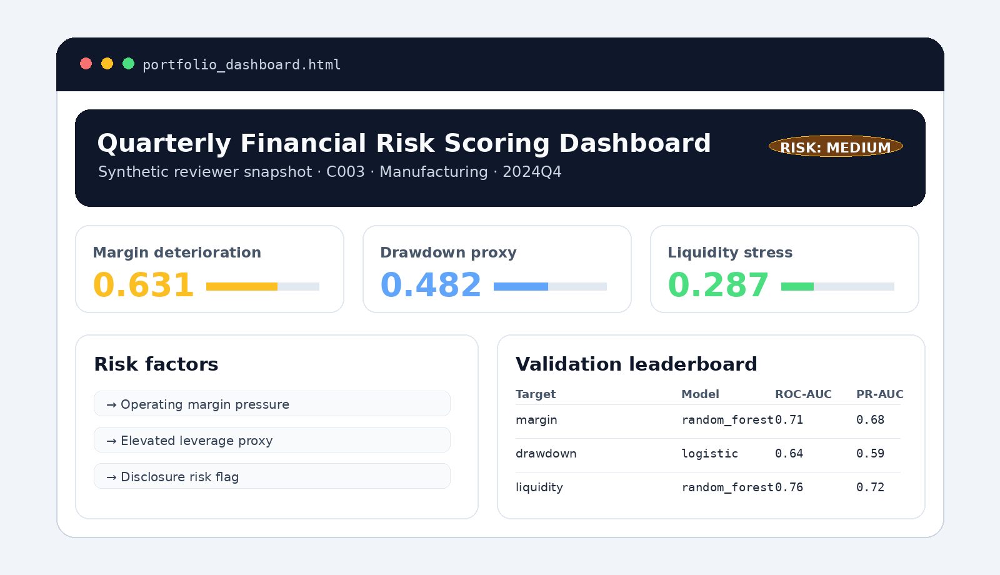
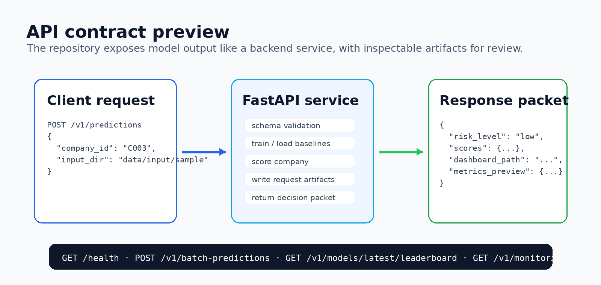

# Quarterly Financial Risk Scoring Service

<p align="center">
  
</p>

<p align="center">
  <a href=".github/workflows/ci.yml"></a>
  
  
  
  
  <a href="https://jcicaaa3-cloud.github.io/financial-future-prediction-service/"></a>
</p>

**Portfolio-grade ML backend project** for scoring next-quarter financial deterioration signals from company-quarter data.

This repository is framed as a **service-shaped ML engineering portfolio**, not as a paper-style forecasting claim. The goal is to show that a tabular financial ML idea can be wrapped with a data contract, leakage-aware feature generation, chronological validation, FastAPI inference, batch scoring, monitoring artifacts, explanation packets, and a reviewer-friendly dashboard.

> **Scope note:** bundled data is synthetic. This is not investment advice, trading advice, lending advice, credit screening, or a real corporate-rating product.

---

## Live GitHub Pages demo

Reviewers can try the project without installing Python. The repository includes a **browser-only live lab** that lets a user change financial indicators, apply shock scenarios, run batch scoring, paste/upload sample CSV rows, copy a cURL request, and download decision-packet JSON/CSV artifacts.

<p align="center">
  <a href="https://jcicaaa3-cloud.github.io/financial-future-prediction-service/"><strong>Open the interactive live lab</strong></a>
</p>

<p align="center">
  
</p>

What a reviewer can do directly in the browser:

- choose a sample company and move financial metric sliders;
- apply Growth upside / Margin shock / Liquidity crunch / Market stress / Disclosure event presets;
- generate and copy a product-style decision packet JSON;
- run multi-company batch comparison;
- paste or upload a small CSV sample and download scored results.

The browser demo is intentionally static: GitHub Pages cannot run the FastAPI backend, so `site/app.js` uses synthetic example companies and explainable heuristic scoring to create a product-style decision packet. The real Python service remains in `app/`, `src/`, and `run_demo.py`.

---

## 30-second pitch

> 한국 상장사 분기 재무·시장·공시 데이터를 입력으로 받아 다음 분기 재무 악화 리스크 신호를 산출하는 ML 백엔드 서비스입니다.  
> 핵심은 모델 성능 과장이 아니라 **서비스화, 검증 설계, 데이터 계약, 모니터링, 문서화, 포트폴리오 스토리텔링**입니다.

<p align="center">
  
</p>

---

## What makes this portfolio-grade?

| Area | What is included | Why it matters in review |
|---|---|---|
| **Problem framing** | Risk-scoring service, not vague “future prediction” | Avoids overclaiming and sounds more professional |
| **Data contract** | Five required CSV inputs with validation rules | Shows backend/data engineering discipline |
| **Feature pipeline** | Ratios, deltas, rolling features, target labels | Demonstrates tabular ML feature work |
| **Leakage awareness** | Time-based split, available-at-time framing, target separation | Important for finance/time-series projects |
| **Model comparison** | Dummy, logistic regression, random forest leaderboard | Shows baseline thinking instead of one-off modeling |
| **Service layer** | FastAPI single prediction, batch prediction, metrics endpoints | Makes the project feel deployable |
| **Artifacts** | Decision packet, risk report, LLM prompt, dashboard, monitoring reports | Turns ML output into product-like deliverables |
| **Ops hygiene** | Docker, GitHub Actions, pytest, ruff config | Signals production-oriented habits |
| **Storytelling** | Korean project card, case study, demo script, visual README assets | Helps recruiters and interviewers review quickly |

---

## System architecture

<p align="center">
  
</p>

The service converts a company-quarter input directory into API-ready and portfolio-ready outputs:

```text
CSV inputs
  -> schema validation
  -> company-quarter panel merge
  -> leakage-aware feature generation
  -> chronological / walk-forward validation
  -> model leaderboard + selected baseline
  -> prediction packet + report + dashboard + monitoring artifacts
```

---

## Dashboard preview

The pipeline generates a static HTML dashboard that a reviewer can open without running a web app.

<p align="center">
  
</p>

Generate the actual dashboard:

```bash
python scripts/build_portfolio_snapshot.py --company-id C003
```

Then open:

```text
examples/portfolio_snapshot/portfolio_dashboard.html
```

---

## API contract preview

<p align="center">
  
</p>

| Method | Path | Purpose |
|---|---|---|
| `GET` | `/health` | Service health check |
| `POST` | `/v1/predictions` | Run a synchronous single-company prediction |
| `POST` | `/v1/batch-predictions` | Train once and score multiple companies |
| `GET` | `/v1/predictions/{request_id}` | Fetch a saved decision packet |
| `GET` | `/v1/models/latest/metrics` | Fetch latest chronological metrics |
| `GET` | `/v1/models/latest/leaderboard` | Fetch baseline comparison table |
| `GET` | `/v1/models/latest/feature-importance` | Fetch global feature-importance packet |
| `GET` | `/v1/monitoring/latest/data-quality` | Fetch data quality report |
| `GET` | `/v1/monitoring/latest/drift` | Fetch simple quarter drift report |

---

## Run locally

```bash
python -m venv .venv
source .venv/bin/activate        # Windows: .venv\Scripts\Activate.ps1
pip install -r requirements.txt
```

Run the full demo pipeline:

```bash
python run_demo.py --company-id C003
```

Build the reviewer snapshot:

```bash
python scripts/build_portfolio_snapshot.py --company-id C003
```

Run tests:

```bash
OMP_NUM_THREADS=1 OPENBLAS_NUM_THREADS=1 MKL_NUM_THREADS=1 pytest -q
```

Run the API:

```bash
uvicorn app.main:app --reload
```

Single prediction request:

```bash
curl -X POST http://127.0.0.1:8000/v1/predictions \
  -H "Content-Type: application/json" \
  -d '{"company_id":"C003","input_dir":"data/input/sample"}'
```

Batch prediction request:

```bash
curl -X POST http://127.0.0.1:8000/v1/batch-predictions \
  -H "Content-Type: application/json" \
  -d '{"company_ids":["C001","C003","C007"],"input_dir":"data/input/sample"}'
```

Open API docs:

```text
http://127.0.0.1:8000/docs
```

---

## Docker

```bash
docker build -t quarterly-financial-risk-service:latest .
docker run --rm -p 8000:8000 quarterly-financial-risk-service:latest
```

---

## Repository layout

```text
app/                                 FastAPI entrypoint
src/financial_risk_scoring/           Core package
  data/                               CSV validation, panel loading, sample generation
  data_sources/                       OpenDART/KRX adapter templates
  evaluation/                         Chronological and walk-forward validation
  explainability/                     Feature importance and explanation packets
  features/                           Ratio, rolling, and target feature generation
  llm/                                LLM-ready prompt packet builder
  models/                             Baseline model training and prediction
  monitoring/                         Data quality and drift reports
  reporting/                          Markdown report and static dashboard
  service/                            End-to-end and batch orchestration
docs/assets/                          README visual assets, GitHub social preview, Pages preview
site/                                 Static GitHub Pages demo site
examples/portfolio_snapshot/           Generated reviewer-friendly outputs
docs/                                 Model card, API contract, system design, case study
tests/                                Pytest suite
.github/workflows/ci.yml              CI pipeline
```

---

## Input files

The service expects five CSV files in one input directory.

| File | Purpose |
|---|---|
| `company_master.csv` | Company id, name, sector |
| `financial_statement_quarterly.csv` | Quarterly financial statements |
| `market_quarterly.csv` | Quarterly market indicators |
| `macro_quarterly.csv` | Macro indicators by quarter |
| `disclosure_features_quarterly.csv` | Disclosure-derived risk fields |

See [`docs/data_contract.md`](docs/data_contract.md) for required columns and validation rules.

---

## Generated decision packet shape

```json
{
  "company_id": "C003",
  "quarter": "2025Q4",
  "risk_level": "medium",
  "scores": {
    "margin_deterioration_risk": 0.438,
    "market_drawdown_proxy_risk": 0.512,
    "liquidity_stress_risk": 0.289
  },
  "top_risk_factors": ["..."],
  "model_explanations": {"...": "..."},
  "artifact_paths": ["decision_packet.json", "risk_report.md", "portfolio_dashboard.html"]
}
```

Exact values vary because the executable sample data is regenerated from a deterministic synthetic process.

---

## GitHub Pages deployment

This version includes a deploy workflow for the static demo site:

```text
.github/workflows/pages.yml
site/index.html
site/styles.css
site/app.js
```

After pushing to `main`, set **Settings → Pages → Build and deployment → Source → GitHub Actions**. The workflow publishes the `site/` directory as the public demo.

Expected URL:

```text
https://jcicaaa3-cloud.github.io/financial-future-prediction-service/
```

---

## GitHub social preview

For a more polished repository card, upload this image in GitHub repository settings:

```text
docs/assets/github_social_preview.png
```

---

## Reviewer notes

This repository is optimized for portfolio review, so the strongest signals are not just the model file. The stronger parts are:

1. clear product framing,
2. reproducible demo commands,
3. data contract and validation,
4. chronological validation rather than random-only splitting,
5. API and batch-scoring service boundary,
6. generated artifacts that make model output understandable,
7. explicit limitations and real-data extension plan.

For Korean portfolio material, see [`PROJECT_CARD_KO.md`](PROJECT_CARD_KO.md), [`PORTFOLIO_PLAYBOOK_KO.md`](PORTFOLIO_PLAYBOOK_KO.md), [`docs/portfolio_case_study_ko.md`](docs/portfolio_case_study_ko.md), and [`docs/github_showcase_ko.md`](docs/github_showcase_ko.md).

---

## Limitations

- The included sample data is synthetic.
- The model is a baseline demonstration, not a production financial model.
- Scores must not be used for trading, lending, credit screening, or real corporate evaluation.
- Real deployment would require audited real-data ingestion, security hardening, calibration monitoring, compliance review, human approval workflows, and model-risk governance.
