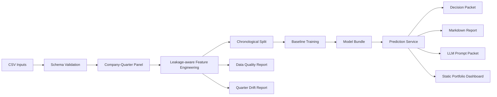

# System Design

## Architecture

## Service boundary

The API layer does not expose model internals directly. It returns structured artifacts:

- scores
- risk level
- top risk factors
- selected model metadata
- feature snapshot
- model-used explanation signals
- paths to generated reports and dashboards

## Why batch scoring exists

A single prediction endpoint is easy to demo, but batch scoring shows a more realistic service pattern: train or load once, score many companies, then return compact summaries for downstream systems.

## Validation design

The evaluation layer uses chronological split and walk-forward evaluation because random split can inflate financial time-series performance. The pipeline also checks for obvious future-label leakage in feature column names.

## Monitoring design

This project includes lightweight monitoring artifacts rather than a full production monitoring platform:

- data quality gates
- missing-rate summary
- constant-feature check
- latest-quarter drift smoke check

These reports are intentionally simple but demonstrate where production-grade monitoring would connect.
